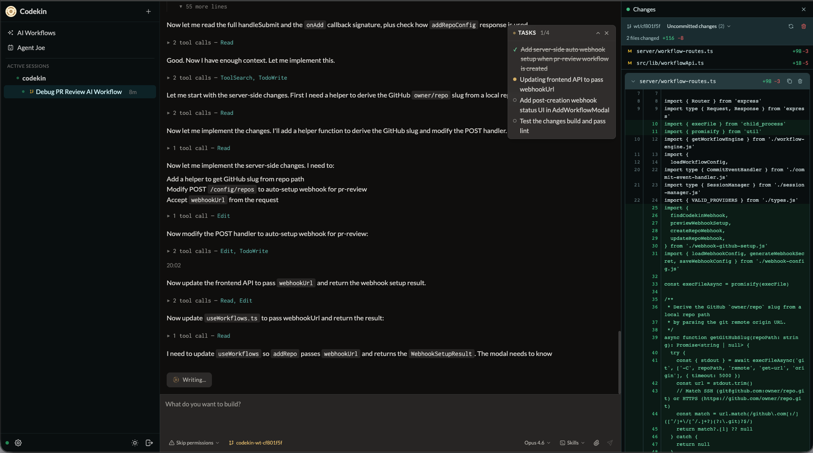

# Codekin

[](LICENSE)
[](https://www.npmjs.com/package/codekin)

**[codekin.ai](https://codekin.ai)**

Web UI for Claude Code sessions — multi-session support, WebSocket streaming, file uploads, and slash-command skills.



## Install

**Prerequisites:**
- macOS or Linux
- [Claude Code CLI](https://github.com/anthropics/claude-code) installed and authenticated (`claude` must be in your PATH)

**One-liner:**

```bash
curl -fsSL codekin.ai/install.sh | bash
```

This will:
1. Install Node.js 20+ if needed (via nvm)
2. Install the `codekin` npm package globally
3. Generate an auth token
4. Install and start a persistent background service
5. Print your access URL

Open the printed URL in your browser, enter your Codekin Web token when prompted, and you're ready to go.

## Usage

```bash
codekin token                   # Print your access URL at any time
codekin config                  # Update API keys and settings
codekin service status          # Check whether the service is running
codekin service install         # (Re-)install the background service
codekin service uninstall       # Remove the background service
codekin start                   # Run in foreground (for debugging)
codekin setup --regenerate      # Generate a new auth token
codekin upgrade                 # Upgrade to latest version
codekin uninstall               # Remove Codekin entirely
```

## Features

- **Multi-session terminal** — Open and switch between multiple Claude Code sessions, one per repo
- **Agent Joe** — AI orchestrator agent that spawns and manages up to 5 concurrent child sessions, with a dedicated chat UI, welcome screen, and color-coded sidebar status indicators
- **Git worktrees** — Isolate sessions in dedicated worktree directories, with mid-session creation, auto-enable setting, and session context preservation
- **Session archive** — Full retrieval and re-activation of archived sessions
- **Repo browser** — Auto-discovers local repos and GitHub org repos
- **Screenshot upload** — Drag-and-drop or paste images; the file path is sent to Claude so it can read them natively
- **Skill browser** — Browse and invoke `/skills` defined in each repo's `.claude/skills/`, with inline slash-command autocomplete
- **Diff viewer** — Side panel showing staged/unstaged file changes with per-file discard support
- **Command palette** — `Ctrl+K` to quickly search repos, skills, and actions
- **Approval management** — Persistent approval storage with per-permission revoking, permission mode selector, and per-session tool pre-approvals
- **Mobile-friendly** — Responsive layout that works on phones and tablets
- **Markdown browser** — Browse and view `.md` files directly in the UI
- **AI Workflows** — Scheduled code and repository audits and maintenance, with support for custom workflows defined as Markdown files
- **GitHub webhooks** — Automated bugfixing on CI failures via webhook integration
- **Upgrade notifications** — In-app banner when a newer version is available

## Upgrade

```bash
codekin upgrade
```

This checks npm for the latest version, installs it, and restarts the background service if running.

Alternatively, re-run the install script:

```bash
curl -fsSL codekin.ai/install.sh | bash
```

## Uninstall

```bash
codekin uninstall
```

This removes the background service, config files, and the npm package.

## Configuration

All configuration lives in `~/.config/codekin/env`. Edit this file to override defaults, then restart the service with `codekin service install`.

| Variable | Default | Description |
|---|---|---|
| `PORT` | `32352` | Server port |
| `REPOS_ROOT` | `~/repos` | Root directory scanned for local repositories |

## Manual / Advanced Setup

For remote servers, custom nginx, or other advanced setups, see [docs/INSTALL-DISTRIBUTION.md](docs/INSTALL-DISTRIBUTION.md).

## Contributing

Contributions are welcome! Please see [CONTRIBUTING.md](CONTRIBUTING.md) for guidelines.

## License

[MIT](LICENSE)
